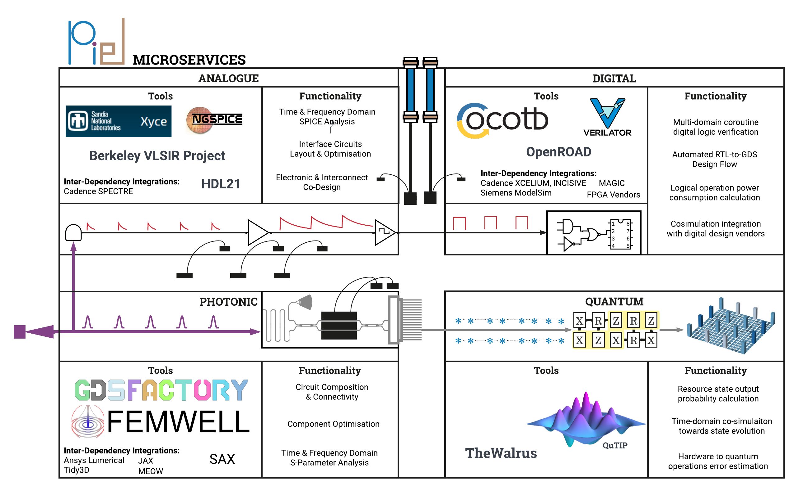

**P**\hotonic **I**\ntegrated **EL**\ectronics
===============================================

|PyPI Name| |PyPI Version| |Build Status| |Documentation Status| |MIT| |Black|

Microservices to codesign photonics, electronics, communications,
quantum, and more.

-  Free software: MIT license
-  Documentation: https://piel.readthedocs.io

Target functionality
--------------------

-  Co-simulation and optimisation between integrated photonic and
   electronic chip design.
-  System interconnection modelling in multiple domains.
-  Chip and interposer design integration.
-  Component models translation library between simulation tools.
-  Quantum models of physical circuitry.

``piel`` aims to provide an integrated workflow to co-design photonics
and electronics, classically and quantum. It does not aim to replace the
individual functionality of each design tool, but rather provide a glue
to easily connect them all together and extract the system performance.

Examples
--------

Follow the many `examples in the documentation <https://piel.readthedocs.io/en/latest/examples.html>`__.

Microservices Toolset
---------------------

This package provides interconnection functions to easily co-design
microelectronics through the functionality of the
`IIC-OSIC-TOOLS <https://github.com/iic-jku/iic-osic-tools>`__ and
photonics via `GDSFactory <https://github.com/gdsfactory/gdsfactory>`__.

Some existing microservice dependency integrations are:

* `cocotb <https://github.com/cocotb/cocotb>`__ - a coroutine based cosimulation library for writing VHDL and Verilog testbenches in Python.
* `hdl21 <https://github.com/dan-fritchman/Hdl21>`__ - Analog Hardware Description Library in Python
* `GDSFactory <https://github.com/gdsfactory/gdsfactory>`__ - An open source platform for end to-end photonic chip design and validation
* `OpenLane v1 <https://github.com/The-OpenROAD-Project/OpenLane>`__ - an automated RTL to GDSII flow based on several components including OpenROAD, Yosys, Magic, Netgen and custom methodology scripts for design exploration and optimization
* `sax <https://github.com/flaport/sax>`__ - S-parameter based frequency domain circuit simulations and optimizations using JAX.
* `thewalrus <https://github.com/XanaduAI/thewalrus>`__ -A library for the calculation of hafnians, Hermite polynomials and Gaussian boson sampling.
* `qutip <https://github.com/qutip/qutip>`__ - QuTiP: Quantum Toolbox in Python

Contribution
------------

If you feel dedicated enough to become a project maintainer, or just
want to do a single contribution, let's do this together!

.. |Black| image:: https://img.shields.io/badge/code%20style-black-000000.svg
    :target: https://github.com/psf/black
.. |Build Status| image:: https://img.shields.io/travis/daquintero/piel.svg
   :target: https://travis-ci.com/daquintero/piel
.. |Documentation Status| image:: https://readthedocs.org/projects/piel/badge/?version=latest
   :target: https://piel.readthedocs.io/en/latest/?version=latest
.. |MIT| image:: https://img.shields.io/github/license/gdsfactory/gdsfactory
   :target: https://choosealicense.com/licenses/mit/
.. |PyPI Name| image:: https://img.shields.io/badge/pypi-piel-blue
   :target: https://pypi.python.org/pypi/piel
.. |PyPI Version| image:: https://img.shields.io/pypi/v/piel.svg
   :target: https://pypi.python.org/pypi/piel
.. |Updates| image:: https://pyup.io/repos/github/daquintero/piel/shield.svg
   :target: https://pyup.io/repos/github/daquintero/piel/
