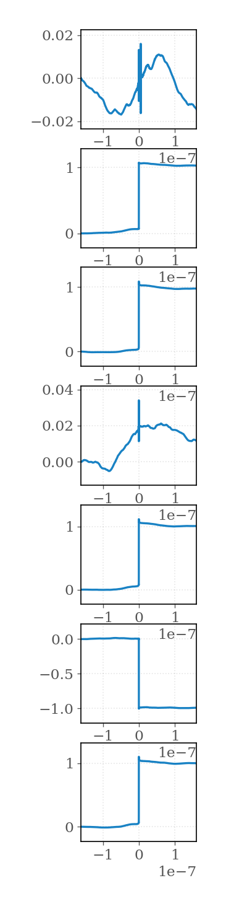

# rf_vna_self_calibration

**Goal**: 

## Experiment Parameters 

|    |   port | measurement   | calibration   |
|---:|-------:|:--------------|:--------------|
|  0 |     12 | through       | vna_ports     |
|  1 |      1 | open          | vna_ports     |
|  2 |      2 | open          | vna_ports     |
|  3 |      1 | load          | vna_ports     |
|  4 |      2 | load          | vna_ports     |
|  5 |      1 | short         | vna_ports     |
|  6 |      2 | short         | vna_ports     |

