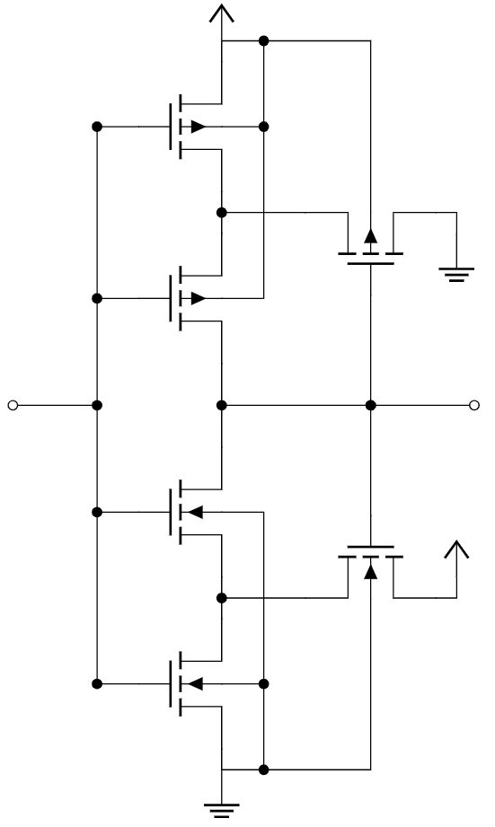
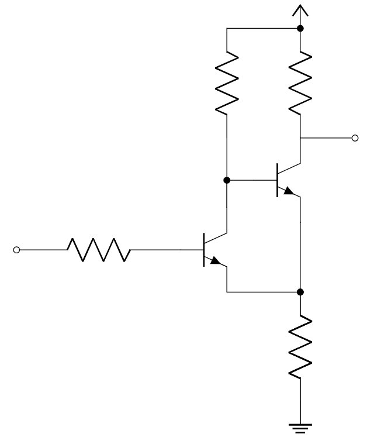

Comparators
============

1. B. L. Dokic, "CMOS Schmitt Triggers," IEEE Proc. G. Electron. Circ. Syst., vol. 131, no. 4, pp. 197-202, 1984.
2. I. M. Filanovsky and H. P. Baltes, "CMOS Schmitt Trigger Design," IEEE Trans. Circuits Syst. I, vol. 41, no. 1, pp. 46-49, 1994.
