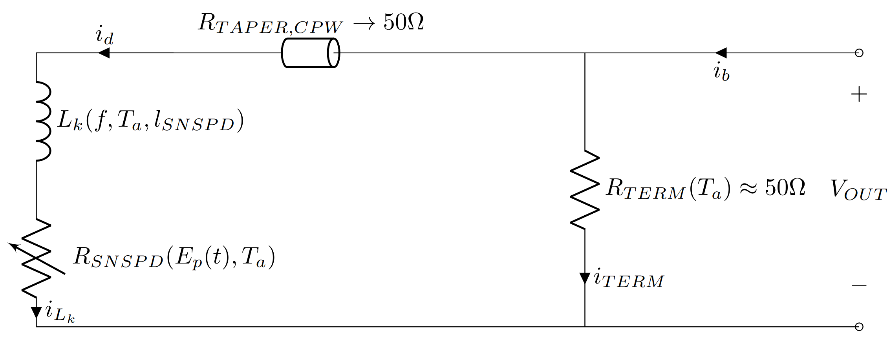

SNSPDs
============

A biasing current, denoted as :math:`i_{d}`, typically in the microampere (:math:`\mu A`) range, needs to be applied across the SNSPD detector in its superconducting state.

WWhen the SNSPD is superconducting, :math:`R_{SNSPD} = 0`, meaning no photons are detected. According to Ohm's law :math:`V=iR_{SNSPD}`, there is a short circuit across the SNSPD. The currents in each node of the interconnected SNSPD circuit model in Figure [1] are derived from Kirchhoff's current law in Equation [2]. The total biasing current applied to the detection component subsystem, :math:`i_b`, is divided across the parallel terminator resistor current :math:`i_{TERM}` and the SNSPD detector biasing current :math:`i_b`.

When a photon with energy :math:`E_p(T) = \frac{\hbar c}{\lambda}` is absorbed, it creates a resistive hotspot in the SNSPD, making :math:`R_{SNSPD} \approx k \Omega`. A high-speed voltage pulse is generated from the energy stored in the SNSPD-meander inductor :math:`E_{L_k}`, as described in Equation [3], flowing across the increasing thermal hotspot due to inductive current :math:`i_{L_k}` resistive dissipation. For a fast cooldown of the SNSPD back to the superconducting state, minimizing the inductive current dissipation is essential [1], and no further SNSPD biasing current :math:`i_d` is required in its resistive state.

The lowest impedance path for the system-biasing current :math:`i_b` in the circuit in Figure [1] is through the parallel terminator resistor :math:`R_{TERM} \approx 50 \Omega`, designed to match the impedance of the high-speed tapered coplanar waveguide :math:`R_{TAPER,CPW}`. While the SNSPD is in its non-superconducting state and needs to cool down to reset, the rest of the system biasing current :math:`i_b` flows through the terminator resistor to prevent electro-thermal dissipation latching.

.. math::

    i_{b} = i_{d} + i_{TERM}

.. math::

    E_{L_k} = \frac{L_k i_b^2}{2}

The output voltage pulse :math:`V_{pulse}` rise time :math:`\tau_{rise}` in Equation [4] is related to the shunt combined complex impedance of the coplanar waveguide and the terminator :math:`Z_{load}`, with the RF interconnection standard 50 :math:`\Omega` impedance. The reset time of the detector is also related to the shunt load impedance and the inductive energy dissipation in Equation [5] [2, 1].

.. math::

    \tau_{rise} = \frac{L_k}{Z_{load} + R_{SNSPD}}

.. math::

    \tau_{reset} = \frac{L_k}{Z_{load}}

The energy dissipated at the SNSPD hotspot immediately during photon absorption :math:`E_p(T) = \frac{\hbar c}{\lambda}` can be expressed in relation to the superconducting-biasing current :math:`i_s`.

.. math::

    E_{L_k} = \frac{L_k (i_b^2 - i_{min}^2)}{2} + \frac{\hbar c}{\lambda}

.. math::

    \tau_{reset} = \frac{L_k}{Z_{load}}

References

1. Annunziata, A. J., Santavicca, D. F., Frunzio, L., Catelani, G., Rooks, M. J., Frye, D., ... & Prober, D. E. (2010). Reset dynamics and latching in niobium superconducting nanowire single-photon detectors. Journal of Applied Physics, 108(8), 084507.
2. Kerman, A. J., Dauler, E. A., Keicher, W. E., Yang, J. K. W., Rosfjord, K. M., & Berggren, K. K. (2006). Kinetic-inductance-limited reset time of superconducting nanowire photon counters. Applied Physics Letters, 88(11), 111116.
