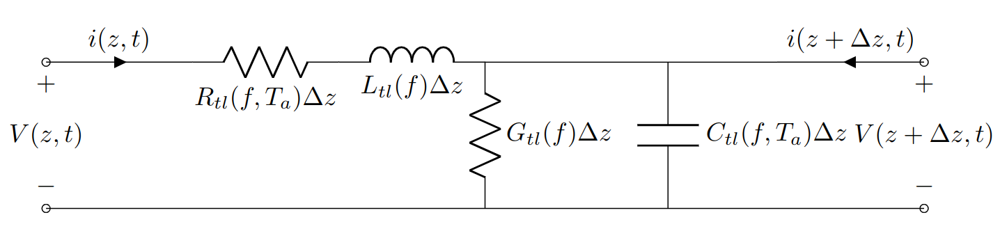

Transmission Lines
===================

TODO properly write this section.

Properties
-----------

Taken from [1] Eq 2.49

Terminated Lossless Transmission Line Fig 2.4 Interface to terminating load at :math:`z=L`

:math:`Z_L \ne Z_0` for incident wave form :math:`V_0^+ e^{-j\beta z}` at :math:`z<0`. Ratio voltage to current is :math:`Z_0`

.. math::

    V(z) = V_0^+ e^{-j\beta z} + V_0^- e^{j\beta z}

Current on the line
.. math::

    i(z) = \frac{V_0^+}{Z_0} e^{-j\beta z} - \frac{V_0^-}{Z_0}  e^{j\beta z}

.. math::

    Z_L(z = L) = \frac{V(z=L)}{i(z=L)} =  \frac{V_0^+ + V_0^-}{V_0^+ - V_0^-} Z_0

.. math::

    V_0^-(z = L) = V_0^+ \frac{Z_L - Z_0}{Z_L + Z_0}

Standing waves in line

.. math::

    V(z) = V_0^+ (e^{j\beta z} + \Gamma e^{j\beta z})

.. math::

    i(z) = \frac{V_0^+}{Z_0} (e^{j\beta z} - \Gamma e^{j\beta z})

Time averaged power flow along the line at a given :math:`z` for a set :math:`f` frequency

.. math::

    P_{avg} = \frac{1}{2} Re\{V(z)I(z)^*\} = \frac{1}{2} \frac{|V_0^+|^2}{Z_0} Re \{1 - \Gamma^* e^{-2j\beta z} + \Gamma e^{2j\beta z} -  |\Gamma|^2\}

Note that :math:`\Gamma^* e^{-2j\beta z} + \Gamma e^{2j\beta z}` TODO give an imaginary result in the form :math:`A - A^* = 2j Im\{ A\}` which is imaginary. (Note this is only for a lossless transmission line)

In this case:

.. math::

    P_{avg} = \frac{1}{2} \frac{|V_0^+|^2}{Z_0} (1 - |\Gamma|^2)

.. math::
    RL(z=L) \; dB = -20 \log(|\Gamma (z=L)|) \; dB

When mismatched

.. math::

   |V(z)| = |V_0^+|  |1 + \Gamma e^{2j\Beta z}| =  |V_0^+|  |1 + |\Gamma| e^{\theta - 2j\Beta l}|

where :math:`l=-z`

.. math::

    V_{max} = |V_0^+|  (1 + |\Gamma|)

.. math::

    V_{min} = |V_0^+|  (1 - |\Gamma|)

.. math::

    SWR = \frac{V_{max}}{V_{min}} = \frac{1 + |\Gamma|}{1 - |\Gamma|}

.. math::

    Z_{in} (l) = \frac{V(-l)}{I(-l)} =Z_0 \frac{V_0^+ (e^{j\beta l} + \Gamma e^{-j\beta l})}{V_0^+ (e^{j\beta l} + \Gamma e^{-j\beta l})}  =  Z_0 \frac{1 + \Gamma e^{-2j\beta}}{1 - \Gamma e^{-2j\beta}}

.. math::

    Z_{in} (l) = Z_0 \frac{(Z_L + Z_0)e^{j\beta l} + (Z_L - Z_0)e^{-j\beta l}}{(Z_L + Z_0)e^{j\beta l} - (Z_L - Z_0)e^{-j\beta l}} = Z_0 \frac{Z_L + j Z_0 \tan(\beta l)}{Z_0 + j Z_L \tan(\beta l)}
    :label: eq:interconnection_input_referred_length_dependent_impedance

First Principles
-----------------

The conductive current is the dominant current effect over displacement current if the conductivity :math:`\sigma >> w \epsilon` dielectric-frequency condition is satisfied on a "good conductor" material [1].

.. math::

    \gamma = \alpha + j \beta = (1 + j) \sqrt{\frac{w \mu \sigma}{2}}

.. math::

    \beta = Im(\gamma) = \sqrt{\frac{w \mu \sigma}{2}}
    :label: eq:phase_constant_good_conductor

.. math::

    \alpha = Re(\gamma) = \sqrt{\frac{w \mu \sigma}{2}}

.. math::

    \eta = (1 + j) \sqrt{\frac{w \mu}{2 \sigma}}

.. math::
    \delta_s = \sqrt{\frac{2}{w \mu \sigma}}

.. math::

    \lambda = \frac{2\pi}{\beta}

.. math::

    v_p = \frac{w}{\beta}

Phase index according to [2]

Transmission Line Telegrapher's Equations
------------------------------------------

.. math::
    \begin{align*}
        R_{tl} << wL_{tl} \\
        G_{tl} << wC_{tl} \\
        R_{tl} G_{tl} << w^2 L_{tl} C_{tl}
    \end{align*}

.. figure:: interconnection/classical_transmission_line_model.tex
    :label: fig:polarimeter_circuit_schematic

[3]

.. math::

    \gamma = \sqrt{(R_{tl}\Delta z + jwL_{tl}\Delta z )(G_{tl}\Delta z + jwC_{tl}\Delta z )}

.. math::

    \frac{v(z,t)}{i(z,t)} = Z_0 = \sqrt{\frac{R_{tl}\Delta z + jwL_{tl}\Delta z}{G_{tl}\Delta z + jwC_{tl}\Delta z}}

Based on [2]

.. math::

    R_{tl}(f) = R_{DC} + R_{AC}\sqrt{f}

Conductive loss:

.. math::

    \alpha_{cul}(f) = \frac{1}{2} \left( \frac{R_{DC} + R_{AC} \sqrt{f}}{Z_{0,ul}} \right)

.. math::

    L_{tl}(f) = L_{\inf, external}(f) + \frac{R_{AC}}{2\pi \sqrt{f}}

The complex permittivity of the medium :math:`\epsilon(f,T_a)`

.. math::

    \epsilon(f,T_a) = \epsilon^{'}(f) - j \epsilon^{''}(f,T_a)

Dielectric loss related to imaginary part of complex permittivity :math:`\epsilon^{''}(f,T_a)`

.. math::

    \epsilon^{''} = \frac{\sigma(f,T)}{w \epsilon_0}

.. math::

    G_{tl} = G_0 + 2 \pi f C_{tl} \tan(\delta)

:math:`G_0` DC dielectric loss.

Total dielectric loss:

.. math::

    \alpha_{dul} = \frac{1}{2}[G_0 + 2 \pi f C_{tl} \tan(\delta)] Z_{0,ul} = \frac{1}{2} \left[ G_0 Z_{0,ul} + \frac{2 \pi \tan(\delta) f \sqrt{\epsilon_{eff}}}{c_0}\right]

Parallel plate parasitic capacitances between in :math:`SiO_2`

.. math::

    C_{SiO_2, parallelplate} = \epsilon_0 \epsilon_{SiO_2} \frac{A_{plate}}{d_separation}

TODO validate frequency, temperature source.
:math:`\epsilon_{SiO_2}(f = DC,T_a = 300K) = 3.9`

Distributed junction capacitance and resistivity of the small signal equivalent circuit of the junction is bias, temperature and voltage dependent.
Per Patel
Effective relative permittivity approximated as average capacitances in substrate and superstrate ignoring dispersion and cross section of transmission line, conductor shape. Higher frequencies permittivity smaller than 3.4

.. math::

    \epsilon_{re} = \frac{\epsilon_{air} + \epsilon_{Si}}{2} = \frac{1 + 11.7}{2}

References
-----------

1. Pozar, David M. *Microwave Engineering*. John Wiley & Sons, 2011.
2. Patel, K. *Design and Analysis of Microwave Circuits*. Academic Press, 2015.
3. Wadell, Brian C. *Transmission Line Design Handbook*. Artech House,
